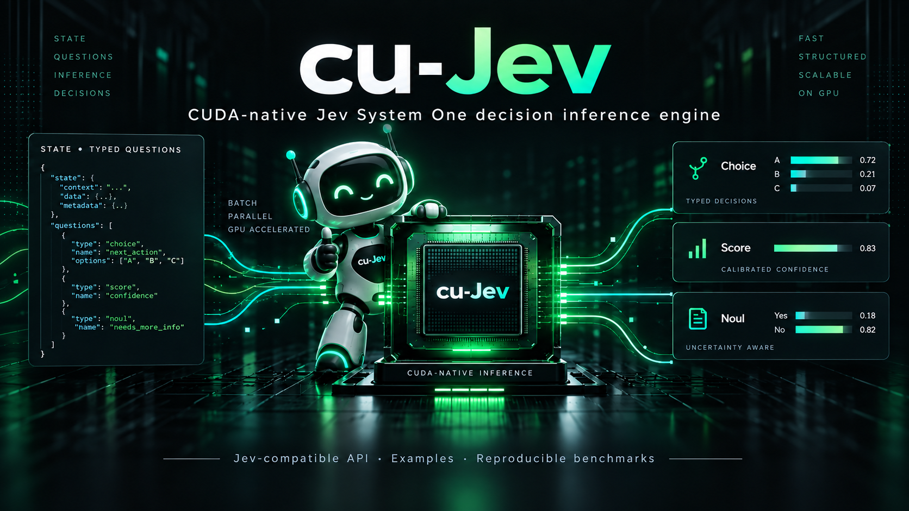
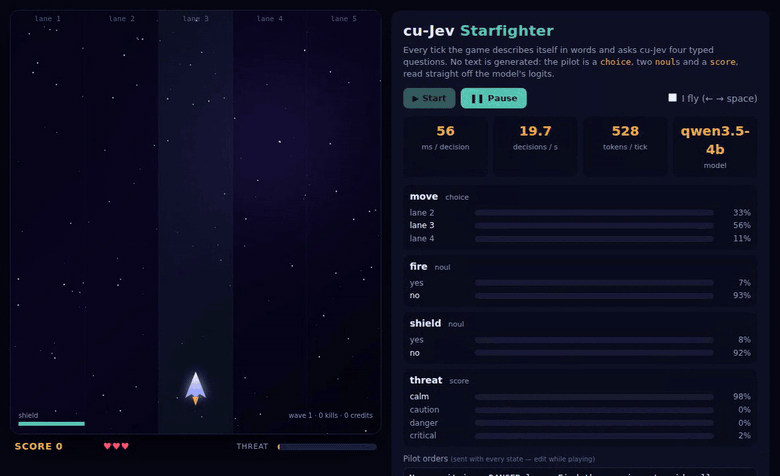

<p align="center"></p>

<h1 align="center">cu-Jev</h1>
<p align="center"><strong>A CUDA-native System One decision engine with a Jev-compatible API.</strong><br>
One state in, many typed decisions out. Full C/CUDA, a little Python, no PyTorch at runtime.</p>

<p align="center">
<code>POST /v1/systemone {state, model, questions} → {model, answers, usage}</code>
</p>

---

cu-Jev turns an open **Qwen3.5** checkpoint (0.8B · 2B · 4B · 9B) into a
*decision function* with the exact wire format of
[TypeSafe's Jev](https://docs.typesafe.ai/api): send a `state` and a map of
typed `questions` (`noul` / `choice` / `score`), get typed answers with
probabilities and confidence. Nothing is decoded, ever.

* **Engine in C/CUDA.** safetensors are mmap'd and uploaded with the
  projections row-fused; every kernel of Qwen3.5's hybrid architecture
  (Gated DeltaNet linear attention + gated GQA attention) is hand-written;
  GEMMs go through cuBLAS. Attention is a FlashAttention-2-style
  `mma.sync` tensor-core kernel.
* **Shared state, isolated branches.** The state runs once. Each question is a
  short branch that attends to the state's KV cache and starts every
  linear-attention layer from the state's recurrent state — one copy,
  read-only, never duplicated per question. Branches never see each other.
* **Read, don't decode.** At the last token of each branch the engine reads the
  logits of the verified single-token option labels straight off the LM head.
* **Drop-in for `typesafe-sdk`.** Point `TYPESAFE_BASE_URL` at cu-Jev and the
  official Python/JS SDKs work unchanged, `models.list()` included.
* **Measured, not claimed.** Checked against `transformers` on every model;
  edge cases across every tile boundary; independent accuracy benchmark;
  shared-prefix benefit quantified against a naive engine and HF.

## Watch it fly

<p align="center"></p>

**[Starfighter](examples/README.md)** is a browser game with no scripted pilot.
Every tick the game describes itself in words — *"Lane 3 (yours): enemy
fighter 41u, enemy bullet 18u (DANGER: hit within a second)"* — and asks
cu-Jev four typed questions in one request: `move` (choice: stay or step to a
neighbouring lane), `fire` and `shield` (nouls), `threat` (score). Asteroid
walls with a single gap, credit clusters and fighters that drift between
lanes make the lane choice matter every second. The answers pass through the
game's own rules; the probabilities are drawn live on the right. Qwen3.5-4B
flies it at ~95 ms per decision on an RTX 3090 (≈ 11 decisions/s, ~530 tokens
of state and questions per tick), and you can rewrite the pilot's orders while
it plays. `uv run cujev serve --model models/Qwen3.5-4B` then open
`http://127.0.0.1:8080/play`. ([mp4](assets/starfighter.mp4))

## Install

Requirements: Linux, an NVIDIA GPU with compute capability 8.0+ (Ampere or
newer), CUDA toolkit 12.4+ / 13 with `nvcc`, CMake ≥ 3.24, and
[uv](https://docs.astral.sh/uv/).

```bash
git clone https://github.com/dtunai/cu-Jev && cd cu-Jev
CUJEV_CUDA_ARCH=120 uv sync          # RTX 5090: builds libcujev.so into the venv, installs the package
CUJEV_CUDA_ARCH=86 uv sync           # RTX 3090 (sm_86 is also the CMake default)
# other:    CUJEV_CUDA_ARCH=89 (Ada)   80 (A100)   90 (Hopper)
```

That is the whole build. `uv sync --extra dev` additionally installs
`torch` + `transformers` (CUDA 13 wheels) for the oracle tests and benchmarks.
Without uv: `make build` gives you `build/libcujev.so` and `build/cujev-bench`
with plain CMake; the Python package finds the library in `build/`.

## Models

| checkpoint | params | layers (full attn) | VRAM (weights + workspace) | status |
|---|---|---|---|---|
| [Qwen/Qwen3.5-0.8B](https://huggingface.co/Qwen/Qwen3.5-0.8B) | 0.8B | 24 (6) | 1.4 + 0.8 GB | tested, oracle-verified |
| [Qwen/Qwen3.5-2B](https://huggingface.co/Qwen/Qwen3.5-2B) | 2B | 24 (6) | 3.6 + 1.1 GB | tested, oracle-verified |
| [Qwen/Qwen3.5-4B](https://huggingface.co/Qwen/Qwen3.5-4B) | 4B | 32 (8) | 7.9 + 1.6 GB | tested, oracle-verified — **recommended** |
| [Qwen/Qwen3.5-9B](https://huggingface.co/Qwen/Qwen3.5-9B) | 9B | 32 (8) | 16.7 + 1.8 GB | tested, oracle-verified |
| Qwen3.5-27B | 27B | 64 (16) | ~54 GB | not yet: 6 q-heads per kv-head needs a kernel variant |
| Qwen3.5-35B-A3B / 122B-A10B / 397B-A17B | MoE | — | — | not supported |

Only the text model is loaded; the vision tower and MTP head inside the
checkpoints are skipped. Workspace is for the default capacity (8 192 state
tokens, 4 096 branch tokens, 256 branches) and shrinks with `--max-*-tokens`.

```bash
uv run scripts/download_model.py Qwen3.5-4B            # -> ./models/Qwen3.5-4B (config, tokenizer, safetensors)
uv run scripts/download_model.py --list                # supported names
uv run scripts/download_model.py Qwen3.5-9B --dest /data/models
```

## Run

```bash
uv run cujev serve --model models/Qwen3.5-4B --port 8080
# CUJEV_API_KEY=secret uv run cujev serve ...            requires Authorization: Bearer secret
# uv run cujev ask --model models/Qwen3.5-4B request.json   one request, no server
```

Then use the official SDK, unchanged:

```python
import os
os.environ["TYPESAFE_BASE_URL"] = "http://127.0.0.1:8080"   # instead of api.typesafe.ai
os.environ["TYPESAFE_API_KEY"] = "local"
from typesafe_sdk import Choice, Noul, Score, TypeSafeClient

r = TypeSafeClient().system_one(
    state="Hi, I've been trying to connect my Stripe account for 3 days and the "
          "integration keeps failing. I'm losing sales. Please help ASAP.",
    questions={
        "department": Choice(instructions="Which team should handle this",
                             criteria={"billing": "Payment or subscription issues",
                                       "technical": "Bugs or integration problems",
                                       "sales": "Pricing or account questions"}),
        "frustration": Score(instructions="How frustrated the customer appears",
                             criteria=["Calm, just stating facts", "Frustrated but civil",
                                       "Very angry, strong language"]),
        "is_urgent": Noul(instructions="The message conveys urgency or time-sensitivity"),
    })
r.answers["department"].choice     # "technical"  (Qwen3.5-4B: p=0.87; the Jev docs' own answer: 0.85)
r.answers["frustration"].score     # 1.11
r.answers["is_urgent"].noul        # 0.99
```

Or curl — the body is TypeSafe's, byte for byte, including structured state:

```bash
curl http://127.0.0.1:8080/v1/systemone -H 'Content-Type: application/json' -d '{
  "model": "jev-latest",
  "state": {"ticket": "My checkout page shows a blank screen after I click Pay.", "customer_tier": "enterprise"},
  "questions": {
    "is_bug": {"type": "noul",   "instructions": "Is the customer reporting a software defect?"},
    "team":   {"type": "choice", "instructions": "Which team should own this ticket?",
               "criteria": {"account": "Login or permissions", "frontend": "Rendering issues", "payments": "Checkout or billing"}},
    "urgency":{"type": "score",  "instructions": "How urgent is this ticket?",
               "criteria": ["Can wait for the next release", "Should be fixed this week", "Blocking revenue right now"]}
  }}'
```

```json
{"model": "cujev/qwen3.5-4b",
 "answers": {"is_bug": {"type": "noul", "noul": 0.84},
             "team": {"type": "choice", "choice": "payments", "probabilities": {"account": 0.0017, "frontend": 0.0055, "payments": 0.9928}, "confidence": 0.97},
             "urgency": {"type": "score", "score": 1.7, "legend": {"0": "...", "1": "...", "2": "..."}, "probabilities": {"0": 0.02, "1": 0.26, "2": 0.72}, "confidence": 0.41}},
 "usage": {"input_tokens": 231, "output_tokens": 8}}
```

`model` accepts `jev-latest`, `jev-1.13`, `cujev-latest` or the served id; the
response reports the served id. Validation errors are 422 with the same
`{detail: [{loc, msg, type}]}` list Jev returns; a bad key is 401. Responses
carry `x-cujev-prefill-ms`, `x-cujev-eval-ms` and `x-cujev-prefix-cached`
headers. `GET /v1/models` and `GET /health` exist.

## Does it work?

**Against the reference.** `tests/python/test_oracle.py` runs real prompts through
cu-Jev and through `transformers` and compares the full-vocabulary logits at
the read-out position: identical argmax and top-5 on every probe for 0.8B, 2B,
4B and 9B. Measured against an **fp32** run of the reference
(`tests/python/oracle_fp32.py`), cu-Jev's next-token distributions are
*closer to fp32 than the reference's own bf16 run* — 4B: L1 0.006 / 0.001 /
0.009 for cu-Jev vs 0.012 / 0.008 / 0.060 for HF-bf16 — because the residual
stream stays in fp32 while GEMMs run in bf16.
`tests/python/test_engine.py` sweeps 55 (state, question) length pairs across
every 16-token query tile and 64-key tile boundary (1…200 × 1…33 tokens), packs
40 branches into one call, checks 256 candidates against full logits, state
reuse determinism and every capacity error — 59 tests, all matching HF, run
with `CUJEV_DEBUG_SYNC=1` (synchronise + error-check after every kernel).
Branch isolation is tested with an adversarial sibling that screams a
different answer. Every kernel compiles with zero spills.

**Is the shared prefix worth it?** `benchmarks/benefit.py`, same tokens, same
model, three ways (1 024-token state, 16 questions × 40 tokens).

RTX 5090:

| | Qwen3.5-4B | Qwen3.5-0.8B |
|---|---|---|
| cu-Jev, shared prefix (prefill + eval) | **91 ms** · 176 decisions/s | **31 ms** · 516/s |
| cu-Jev, state already cached (eval only) | **34 ms** · 471/s | **10 ms** · 1 600/s |
| cu-Jev, naive (re-prefill state+question per question) | 1 203 ms · 13/s | 380 ms · 42/s |
| HF transformers, batched, `flash-linear-attention` installed | 939 ms · 17/s | 416 ms · 38/s |
| argmax agreement, shared vs naive / vs HF | 100 % / 100 % | 100 % / 100 % |

RTX 3090, same workload:

| | Qwen3.5-4B | Qwen3.5-0.8B |
|---|---|---|
| cu-Jev, shared prefix (prefill + eval) | **223 ms** · 72 decisions/s | **66 ms** · 244/s |
| cu-Jev, state already cached (eval only) | **84 ms** · 191/s | **21 ms** · 749/s |
| cu-Jev, naive (re-prefill state+question per question) | 2 933 ms · 5/s | 809 ms · 20/s |
| HF transformers, batched, `flash-linear-attention` installed | 2 291 ms · 7/s | 887 ms · 18/s |
| argmax agreement, shared vs naive / vs HF | 100 % / 100 % | 100 % / 100 % |

Sharing the state is **13× faster per request and 35× once the state is
cached**; against HF transformers doing the same batched read-out, cu-Jev is
**10× faster (27× cached)** on the 4B. The ratios match on both GPUs.

**On an independent benchmark.** [`LocalLLaMA/typed-decisions`](https://huggingface.co/datasets/LocalLLaMA/typed-decisions),
test split — 400 cases × 5 questions over four enterprise workflows; every row
is literally a `/v1/systemone` body with gold distributions. Zero-shot, one
prompt for all workflows, no tuning:

| model | top-1 acc | Brier Σ | Brier /K | ECE | 5090 ms / case | 3090 ms / case |
|---|---|---|---|---|---|---|
| cu-Jev · Qwen3.5-0.8B | 46.4 % | 0.352 | 0.113 | 0.218 | 17 | 37 |
| cu-Jev · Qwen3.5-2B | 48.9 % | 0.323 | 0.105 | 0.165 | 23 | 56 |
| cu-Jev · Qwen3.5-4B | 63.1 % | 0.224 | 0.071 | 0.104 | 53 | 129 |
| cu-Jev · Qwen3.5-9B | **64.0 %** | 0.223 | 0.064 | 0.112 | 93 | 227 |

For scale, numbers other projects publish on the same split (their
measurements, not ours): TF-IDF + logistic regression *trained on the train
split* 66.1 %, TypeSafe Jev 1.13 72.7 % (as catalogued by Laya), Laya 76.6 %
and openJev-verdict-2.0 77.1 % (both trained encoders). cu-Jev's numbers are
what the base models know with a generic prompt; prompt tuning per workflow
and calibration are on the roadmap.
`uv run benchmarks/typed_decisions.py --model models/Qwen3.5-4B` reproduces it.

## Speed

`build/cujev-bench <checkpoint> P B L C` — P state tokens, B branches of L
tokens, C candidates; bf16, CUDA 13.3. Prefill is paid once per state; eval
is the per-request cost. Same workloads on an RTX 5090 and an RTX 3090.

RTX 5090:

| model | state | branches | prefill | eval | decisions/s |
|---|---|---|---|---|---|
| 0.8B | 1 024 | 16 × 40 | 25 ms (41.0k tok/s) | 10 ms | 1 600 |
| 0.8B | 8 192 | 64 × 40 | 204 ms | 48 ms | 1 330 |
| 2B | 1 024 | 16 × 40 | 30 ms (34.1k tok/s) | 16 ms | 1 000 |
| 4B | 1 024 | 16 × 40 | 60 ms (17.1k tok/s) | 37 ms | 430 |
| 4B | 8 192 | 64 × 40 | 0.55 s | 185 ms | 350 |
| 9B | 1 024 | 16 × 40 | 106 ms (9.7k tok/s) | 61 ms | 262 |

RTX 3090:

| model | state | branches | prefill | eval | decisions/s |
|---|---|---|---|---|---|
| 0.8B | 1 024 | 16 × 40 | 54 ms (18.8k tok/s) | 21 ms | 777 |
| 0.8B | 8 192 | 64 × 40 | 435 ms | 102 ms | 630 |
| 2B | 1 024 | 16 × 40 | 72 ms (14.1k tok/s) | 39 ms | 408 |
| 4B | 1 024 | 16 × 40 | 149 ms (6.9k tok/s) | 88 ms | 181 |
| 4B | 8 192 | 64 × 40 | 1.3 s | 440 ms | 145 |
| 9B | 1 024 | 16 × 40 | 259 ms (3.9k tok/s) | 148 ms | 108 |

Where the time goes (4B, nsys): cuBLAS GEMMs ≈ 60 % at the bf16 tensor-core
ceiling (~210 TFLOPS on the 5090, ~70 TFLOPS on the 3090); the recurrent
Gated-DeltaNet scan ≈ 15 % (serial over the state; the chunked algorithm is
the next optimisation); tensor-core attention ≈ 10 %. A 40-token question on
the 4B costs ~2 ms on the 5090 and ~5 ms on the 3090, regardless of how long
the state is.

### Other GPUs

Ada, Hopper and A100:

```bash
CUJEV_CUDA_ARCH=89 uv sync             # 4090; A100: 80; H100: 90
uv run scripts/download_model.py Qwen3.5-4B
make bench ARCH=89 MODEL=models/Qwen3.5-4B
uv run benchmarks/benefit.py --model models/Qwen3.5-4B --no-hf
```

## How it works

```
                 state tokens ──► prefill once ──► per layer: KV cache (full attn)
                                                            recurrent S + conv tail (linear attn)
 question 1 ─┐
 question 2 ─┼─► one batched forward: every token sees [state ++ own branch] only
 question N ─┘                       ──► last token of each branch ──► logits of its option labels
```

* **Prompt layout.** One shared prefix (system rules + `STATE:` + the state as
  text or pretty JSON) and one suffix per question ending at the assistant's
  first token, where the logits of the labels are read. `choice` uses verified
  single-token labels `A`…`Z`, `AA`…; `noul` reads `yes`/`no`; `score` reads
  the digits `0`…`K-1`. Softmax over those logits is exactly the base model's
  next-token distribution renormalised to the options;
  `confidence = 1 − H(p)/ln K`.
* **Kernels.** `attention.cu`: per-head zero-centred RMSNorm + partial RoPE
  prep, then a FlashAttention-2 kernel on `mma.sync.m16n8k16` (bf16 → fp32):
  one block = 16 query tokens × the 4 q-heads of one kv-head, K/V tiles of 64
  keys in padded shared memory, `ldmatrix.trans` for V, online softmax in base
  2, P kept in registers, output gate fused into the epilogue.
  `gdn.cu`: depth-wise causal conv, l2-norm/gate prep, the gated delta rule
  with the 128×128 fp32 state held in registers (each column split over two
  lanes, partner reduction by shuffle), gated RMSNorm.
* **Numerics.** Residual stream fp32, GEMM inputs/outputs bf16, everything
  else fp32. Details, the execution model and the verification story are in
  [docs/ARCHITECTURE.md](docs/ARCHITECTURE.md).

## Repository

```
include/cujev/cujev.h      public C API (open model · prefill state · eval branches · full logits)
src/core/                  config.json parser, safetensors mmap loader, device arena
src/engine/                weights → device (row-fused projections), the forward pass
src/kernels/               attention.cu · gdn.cu · elementwise.cu (embed, norms, SiLU·up, cuBLAS, read-out)
python/cujev/              ctypes binding · prompt layout & labels · Jev semantics · FastAPI server · CLI
scripts/download_model.py  checkpoint downloader
tests/python/              HF oracle · edge cases · prompt layer (CPU)
benchmarks/                typed-decisions replay · benefit study · README of results
tools/bench.c              raw engine benchmark (build/cujev-bench)
docs/ARCHITECTURE.md       execution model, kernels, numerics, verification, roadmap
```

```bash
make test        # CPU tests
make test-gpu    # oracle + edge cases vs HF   (MODEL=models/Qwen3.5-0.8B)
make bench       # build/cujev-bench on MODEL
```

The C API is three calls — `cujev_model_open`, `cujev_state_prefill`,
`cujev_eval` — and is usable from any language; the Python layer is ~700 lines.

## Limits and roadmap

* Probabilities are the base model's, renormalised over the options; they are
  **not** calibrated the way Jev's RLCD-trained model claims to be. Temperature
  / isotonic calibration on typed-decisions, reported per question type, is
  next.
* Options are read through single-token labels. Teacher-forced multi-token
  scoring of the option names themselves is planned as an alternative.
* Next in the engine: chunked (WY) Gated-DeltaNet prefill on tensor cores,
  fused residual+norm epilogues, CUDA-graph capture of the eval path, a
  6-heads-per-kv-head attention variant for 27B, INT8 weights for a 2× GEMM
  ceiling on Ampere.

## License

Apache-2.0. cu-Jev is an independent project, not affiliated with TypeSafe AI;
"Jev" and "System One" are their names, used here to describe API
compatibility. Qwen3.5 checkpoints are under their own license. cJSON (MIT) is
vendored in `third_party/`.
